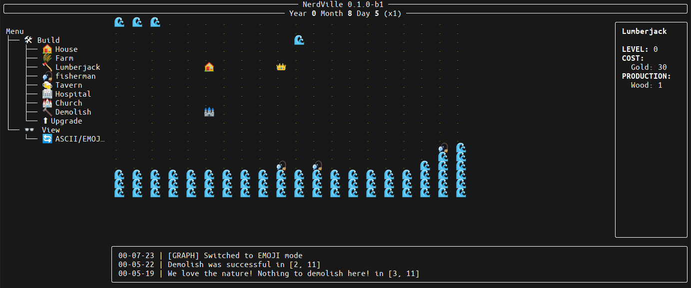

# NerdVille

Create your village in your console

## Symbols

### Charaters

| Name | Icon                                 | Emoji |
|:-----|:------------------------------------:|:-----:|
| King | **W** | 👑    |

### Resources

| Name         | Emoji |
|:-------------|:-----:|
| fish         | 🐟    |
| gold         | 💰    |
| hay          | 🌽    |
| happiness    | 😃    |
| health       | ⚕     |
| spirituality | 🙏    |
| population   | 📊    |
| wood         | 🌳    |

### Buildings

| Name       | Icon                                    | Emoji |
|:-----------|:---------------------------------------:|:-----:|
| Bridge     | **=**  | 🟫    |
| Castle     | **0**                                   | 🏰    |
| Church     | **+**                                   | ⛪    |
| Farm       | **#** | 🌾    |
| Fisherman  | **F**   | 🎣    |
| Hospital   | **H**                                   | 🏥    |
| House      | **X**                                   | 🏠    |
| Lumberjack | **T**  | 🪓    |
| Tavern     | **U**                                   | 🍻    |

### Environments

| Nam    | Icon                                   | Emoji |
|:-------|:--------------------------------------:|:-----:|
| Grass  | .     |       |
| Water  | **~**  | 🌊    |
| Rock   | *      |       |

## Keyboard

| Action                   | Shortcut      |
|--------------------------|:-------------:|
| Move King Up             | `w`           |
| Move King Up             | `arrow up`    |
| Move King Down           | `s`           |
| Move King Down           | `arrow down`  |
| Move King Left           | `a`           |
| Move King Left           | `arrow left`  |
| Move King Right          | `d`           |
| Move King Right          | `arrow right` |
| Move King to Castle      | `c`           |
| Move King to map origin  | `0`           |
| Increment Time Speed     | `page up`     |
| Decrement Time Speed     | `page down`   |
| Pause ON/OFF             | `p`           |
| Switch ASCII/Emoji Style | `Control + g` |
| Quit                     | `Control + q` |

---

## Screenshoots

The game can be played in textual mode (default) or emoji mode

### Textual Mode

### Emoji Mode

# Support

