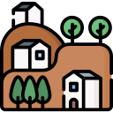

# NerdVille

Create your village in your console

<a href="https://www.flaticon.com/free-icons/village" title="village icons">Village icons created by Freepik - Flaticon</a>

Use the software at your own risk. Continuous code developments may cause you to lose your game data.

---

## Social

---

## Screenshoots

The game can be played in textual mode (default) or emoji mode

### Textual Mode

### Emoji Mode

# Support

