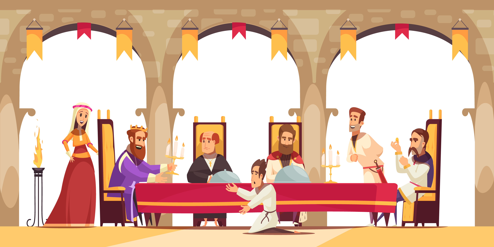
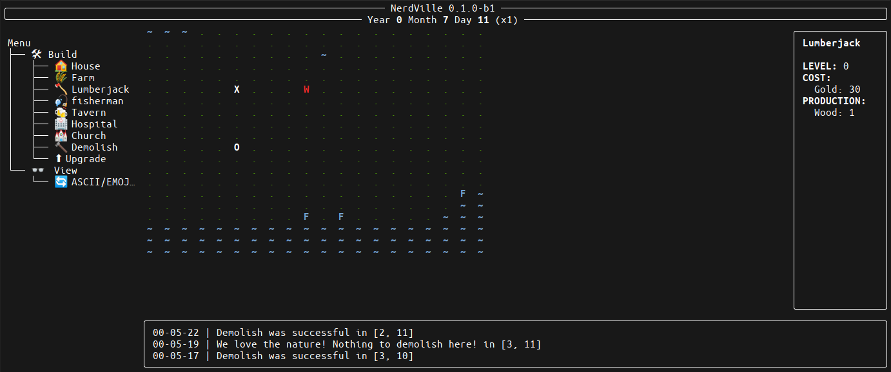

# NerdVille

Create your village in your console

Use the software at your own risk. Continuous code developments may cause you to lose your game data.

# The Story

You were the promising scion of a small noble family, but after you were caught having romantic relations with a goat, your family disowned you and kicked you off their land.

With little money in your pocket, you travel the world until you find an old abandoned castle.

You decide to redeem your life...

# Screenshoots

The game can be played in textual mode (default) or emoji mode

### Textual Mode

### Emoji Mode

---

# Social

# Support

# Acknowledgements

<a href="https://www.flaticon.com/free-icons/village" title="village icons">Village icons created by Freepik - Flaticon</a>

<a href='https://www.freepik.com/vectors/king-cartoon'>King cartoon vector created by macrovector - www.freepik.com</a>
